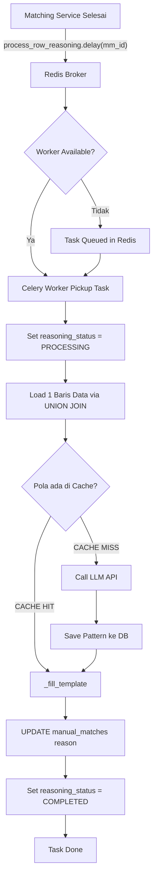

# Reasoning Service (AI Data Matching)

Service ini bertanggung jawab untuk menganalisis dan memberikan alasan *(reasoning)* mengapa sepasang identitas antara *incoming data* dan *master data* tidak cocok. Menggunakan kombinasi mekanisme *Pattern Caching* (Hash) dan LLM (Ollama / vLLM) untuk menghasilkan penjelasan dalam Bahasa Indonesia.

## Arsitektur (Event-Driven)

Sistem menggunakan **Celery + Redis** untuk pemrosesan asinkron. Ketika proses *Matching Service* selesai, ia akan langsung mendelegasikan tugas *reasoning* ke Celery Worker melalui antrean Redis.

### Diagram Alur Pemrosesan



---

## Konfigurasi Environment (`.env`)

Service ini membutuhkan konfigurasi berikut di file `.env`:

```env
# Koneksi Broker (Wajib untuk Celery)
REDIS_URL="redis://localhost:6379/0"

# LLM Provider (Pilih 'ollama' atau 'vllm')
LLM_PROVIDER="ollama" 

# Base URL Model
OLLAMA_LOCAL_BASE_URL="http://localhost:11434"

# Konfigurasi Ollama (jika LLM_PROVIDER=ollama)
OLLAMA_MODEL_NAME="llama3.1:8b-instruct-q4_K_M"

# Konfigurasi vLLM (jika LLM_PROVIDER=vllm)
VLLM_MODEL_NAME="meta-llama/Meta-Llama-3-8B-Instruct"
OPENAI_API_KEY="EMPTY"
```

> **Tips:** Jika server menghadapi request yang sangat masif, sangat disarankan untuk mengubah `LLM_PROVIDER=vllm` dan menjalankan server vLLM, karena vLLM memiliki fitur *Continuous Batching* dan *PagedAttention* yang tahan terhadap ribuan request per detik (berbeda dengan Ollama yang diperuntukkan untuk desktop/testing).

---

## Cara Menjalankan

### 1. Menjalankan FastAPI (API Server)
Jalankan server API utama seperti biasa:
```bash
uvicorn main:app --host 0.0.0.0 --port 9191
```

### 2. Menjalankan Celery Worker
Jalankan Celery Worker di *terminal session* atau *process manager* terpisah (misal: PM2/Supervisor/Systemd):
```bash
# Aktifkan virtual environment
.venv\Scripts\activate

# Jalankan worker dengan pool threads
uv run celery -A reasoning.celery_app worker --pool=threads --concurrency=3 --loglevel=info
```
*Gunakan `--concurrency=3` (atau lebih) untuk memproses 3 antrean baris secara bersamaan. Arsitektur terbaru ini menggunakan Row-Level Parallelism di mana 1 baris di tabel `manual_matches` = 1 task mandiri di Celery.*

---

## Panduan Migrasi ke Independent Microservice

Saat ini, `MatchingService` dan `ReasoningService` berada di dalam satu *codebase* dan di-deploy bersamaan. Jika di masa depan `ReasoningService` ingin dipisah ke server / repository mandiri *(Independent Microservice)*, ikuti langkah berikut:

1. **Pisahkan Repo**: Ekstrak folder `reasoning/` ke dalam repository baru.
2. **Koneksi Redis**: Pastikan *Microservice Matching* dan *Microservice Reasoning* menunjuk ke URL Redis yang sama.
3. **Ubah Cara Trigger**: Di *Matching Service*, Anda tidak bisa meng-*import* `process_row_reasoning`. Gantilah *trigger* di `processing/handler.py` menjadi perulangan yang menggunakan `send_task` per ID baris:

```python
# Di dalam codebase Matching Service:
from celery import Celery

celery_client = Celery(broker="redis://...")

# Looping id dari manual_matches
for mm_id in list_of_pending_ids:
    celery_client.send_task("reasoning.process_row", args=[mm_id])
```
Dengan cara ini, `MatchingService` sama sekali tidak perlu mengetahui detail kode dari `ReasoningService`. Keduanya berkomunikasi hanya melalui pesan *(message passing)* di Redis!
